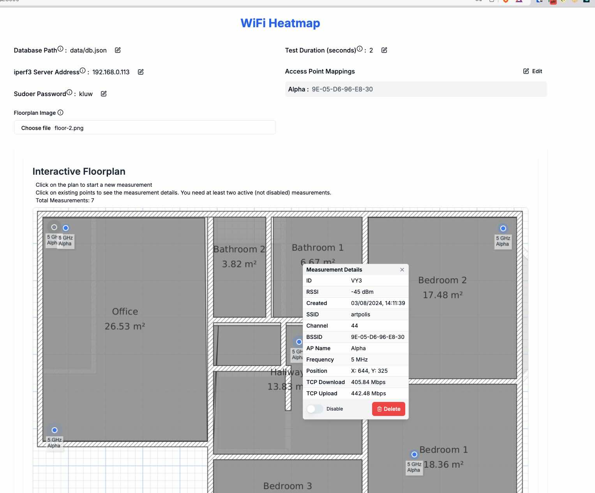

# WiFi Heatmapper

This project is a WiFi heatmapper solution for macOS/Windows/Linux, inspired by [python-wifi-survey-heatmap](https://github.com/jantman/python-wifi-survey-heatmap). I wanted to create a heatmap of my WiFi coverage, but the original project didn't work because I am running on Mac (Apple Sillicon). I also wanted just something that might be slightly easier to use, i.e. via browser.




## Recording

[](https://www.youtube.com/watch?v=pXlm-eWaJCs)

## Prerequisites

- macOS, Windows, Linux
- `npm` and `iperf3` installed
  - on macOS can be installed via `brew install npm iperf3`

## Platform-Specific Commands

This utility relies on parsing outputs of the following CLI commands.

| Platform | Commands          | Notes                                                                                                                                                   |
| -------- | ----------------- | --------------------------------------------------------------------------------------------------------------------------------------------------------|
| macOS    | `wdutil`, `ioreg` | Both are usually part of the system, sudo password is needed for `wdutil`                                                                               |
| Windows  | `netsh`           | Part of the system                                                                                                                                      |
| Linux    | `iw`              | `iw` might need to be installed via your distro package manager, you will need to provide your wireless device id (e.g. "wlp4s0", we do try to infer it)|

> [!IMPORTANT]  
> In all cases, `iperf3` must be available in `PATH`. For Windows you might have to do something like `set PATH=%PATH%;C:\path\to\iperf3`, e.g. do `set PATH=%PATH%;C:\iperf3` (or `setx` to make it permanent) before running `npm run dev`.

## Installation

    git clone https://github.com/hnykda/wifi-heatmapper.git
    cd wifi-heatmapper
    npm install

## Usage

1. (optional check) that your `iperf3` command works by `iperf3 --version`
1. Start the application from where you want to run the tests (very likely your Mac/Windows laptop so you can move around the house):

   ```bash
   npm run dev
   ```

2. On a separate server that you want to run the tests against, run the following command to start the `iperf3` server (you will need its IP address to be accessible from the laptop running the application):

   ```bash
   iperf3 -s
   ```

3. Open a web browser and go to `http://localhost:3000`.

4. Upload your floor plan image. You might have to create it using some other software, such as `sweethome3d`.

5. Follow the on-screen instructions to complete the WiFi survey and generate the heatmap.

## How does this work

It's actually pretty simple. The app is written in Next.js. To get the information, we invoke the `iperf3`, `wdutil` and `ioreg` commands (or equivalent on different platforms) via JS `child_process` and parse the output. The webapp then just stores everything in simple JSON "database" file.

## Credits

This project was inspired by [python-wifi-survey-heatmap](https://github.com/jantman/python-wifi-survey-heatmap). Special thanks to the original author for their work.

## Contributing

Feel free to contribute to this project by opening an issue or submitting a pull request. I am more than happy for that!

## Notes

This tool relies on command line utilities that are able to parse information about wifi. The problem is that the major proprietary OS vendors like Mac or Windows are making this stupidly hard. For example, `wdutil` worked on MacOS 14, stopped working on 15.0-15.2 (SSID and BSSID started to show as `<redacted>` as if this is useful for anyone 🙄), and started working again on 15.3. There are often multiple ways how to get this, but again, this is time consuming and very annoying.

I have made an extensive search for any cross-platform libraries in JS or Python that would do this, but I haven't found any that would do what I need and be maintained and updated (somewhat understandably, this is pretty annoying). Also, a lot of these libs focus on also manipulating connection, while we only need to read information about it (so slightly easier task). Therefore, for the foreseable future, this app is going to do it low-level raw CLI commands, ideally built-ins, with as little privileges and configuration as possible.

### Some ideas one could work on:

1. extend this to work on Linux (should be a piece of cake as opposed to the trash MacOS has)
2. find out how to get RSSI and other stuff from `ioreg` so sudo is not needed (for `wdutil`)
3. make the app more user-friendly and informative (step by step wizard for the measurements)
4. serialize the image to the database file so it can be loaded later
5. add leaflet to make the maps interactive
6. load/save heatmap config to database
7. infer the relevant command/OS version and use the relevant commands and parser based on that to make this multi-platform.
